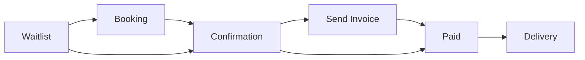
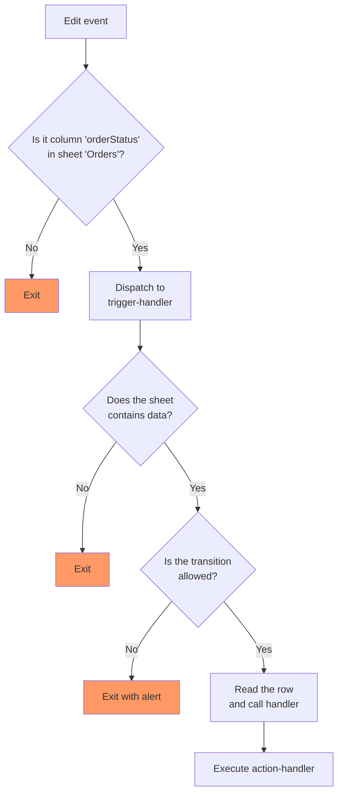

# 📋 Lookup Table Pattern in Apps Script

This project demonstrates an efficient and maintainable way to handle dropdown value changes in Google Sheets using Google Apps Script. By leveraging a **lookup table pattern (dispatch table)**, it enables scalable, readable, and flexible management of status transitions—ideal for workflows like order processing, task tracking, or any state-based automation.

It promotes clean separation of business logic, reduces complex conditional code, and simplifies adding or updating workflow steps.

## ❓ Why This Pattern?

Traditional `if/else` or `switch` statements can quickly become hard to read and maintain—especially when handling many status transitions with complex branching.

The **lookup table pattern** solves this by using a **dispatch table**: a plain object that maps values to functions. This keeps logic **declarative**, **modular**, and **scalable**:

* ✅ **Easier to maintain** – Add or change transitions in a single config file
* ✅ **No duplicate logic** – Avoids repeating code for similar transitions
* ✅ **Improves readability** – The structure clearly shows what transitions are allowed
* ✅ **Reduces bugs** – Each handler is isolated and easy to test

This pattern is ideal when you want to enforce specific business rules tied to dropdown selections, without bloating your main logic.


## 💡 What It Does

### Business process



### Workflow

* Detects **dropdown changes** in a target column of a specific sheet (**column A** in sheet **"Orders"**)
* Validates transitions against a predefined map `ORDERSTATUS_CONFIG`
* Calls the corresponding **handler function** for valid transition
* Ignores invalid or unsupported transitions silently or with optional alerts


## 🧠 Pattern Overview

This project uses a **dispatch table** (lookup object) to determine which function to call when a dropdown value changes:

```javascript
const ORDERSTATUS_CONFIG = readOnlyObject({
  'Waitlist': {
    bgColor: '#ffcfc9',
    transitions: {
      'Booking': handleBooking,
      'Confirmation': handleBooking
    }
  },
  'Booking': {
    bgColor: '#d4edbc',
    transitions: {
      'Confirmation': handleBooking
    }
  },
  'Delivery': {
    bgColor: '#15dae7',
    transitions: {}
  }
});
```

Transitions not listed in `ORDERSTATUS_CONFIG` are safely ignored.


## 🗂 File Structure

| File                  | Purpose                                                                 |
| --------------------- | ------------------------------------------------------------------------|
| `action-handlers.gs`  | Handler functions for specific dropdown transitions                     |
| `config.gs`           | Centralized config for sheet name, editable column, and transition map  |
| `triggers.gs`         | Sets up simple and installable triggers                                 |
| `trigger-handlers.gs` | Handler functions for triggers                                          |
| `utils.gs`            | Utility and helper classes/functions                                    |


## 🔍 How It Works

When a user **changes a dropdown** the `edit(e)` function does the following:




## 🧪 Example Use Case

Suppose you have a dropdown in column A of your "Orders" sheet:

| Status          | Order ID    | Client Name |
| --------------- | ----------- | ----------- |
| `Waitlist`      | V8K3J1T7PQ  | Alice       |
| `Confirmation`  | XG5PLQ7YTZ  | Bob         |

When a user changes:

* `Waitlist → Booking`
  → `handleBooking()` is executed

* `Confirmation → Paid`
  → `handleInvoice()` is executed


## 🧩 Related Projects

This project builds on the **[Dynamic Google Sheets Layout](https://github.com/sangnandar/Dynamic-Google-Sheets-Layout)** pattern to keep sheet references clean, maintainable, and column-safe.

If you're managing Google Sheets by column **names** instead of hardcoded indexes, check it out!
